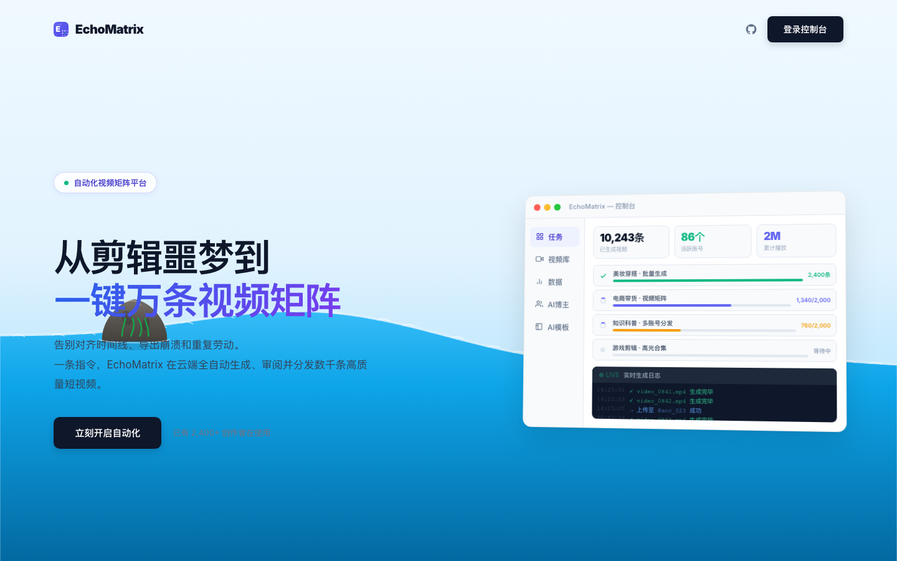
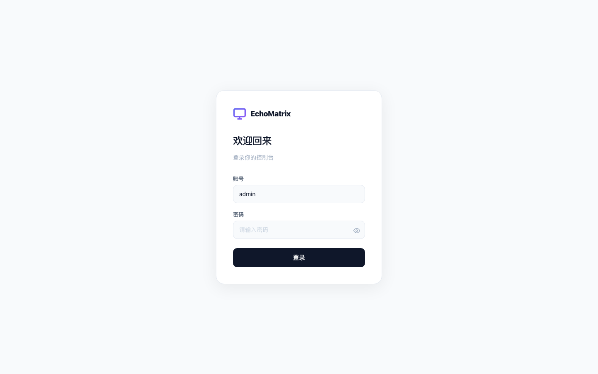
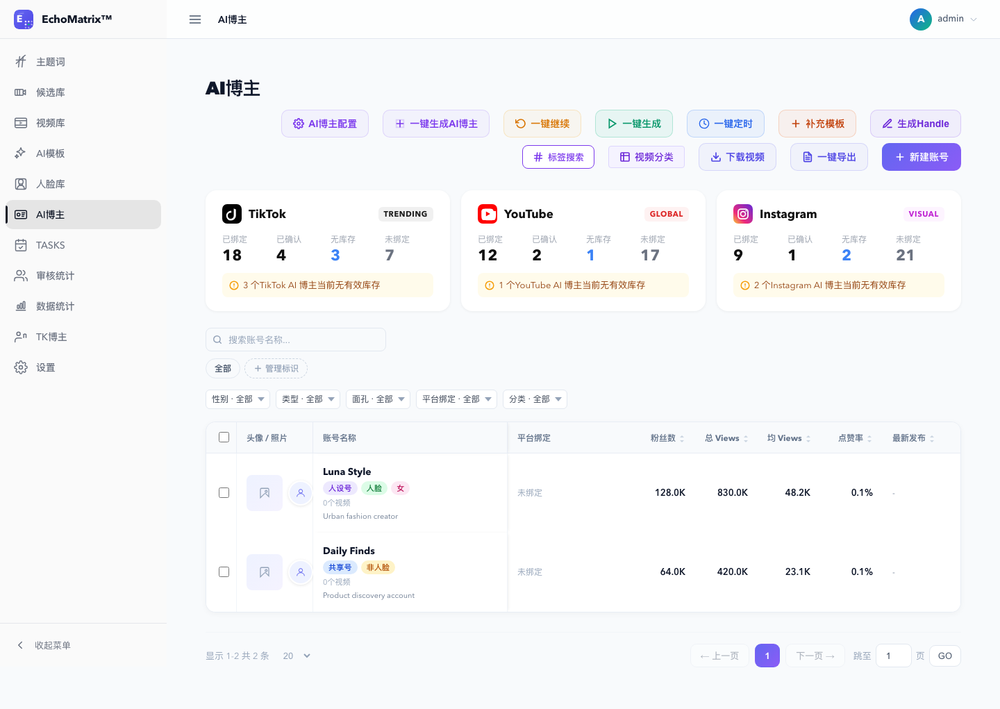
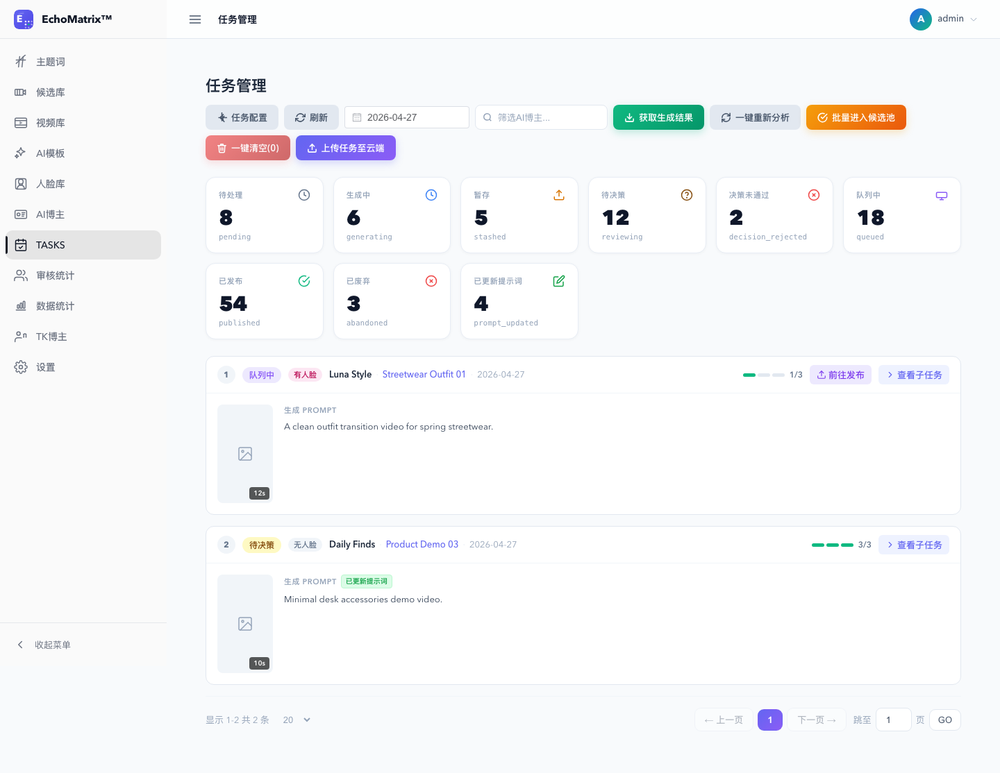
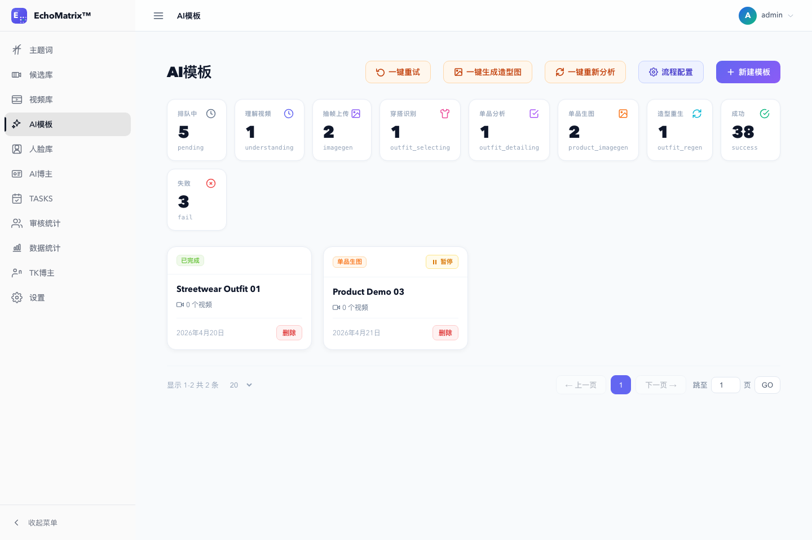
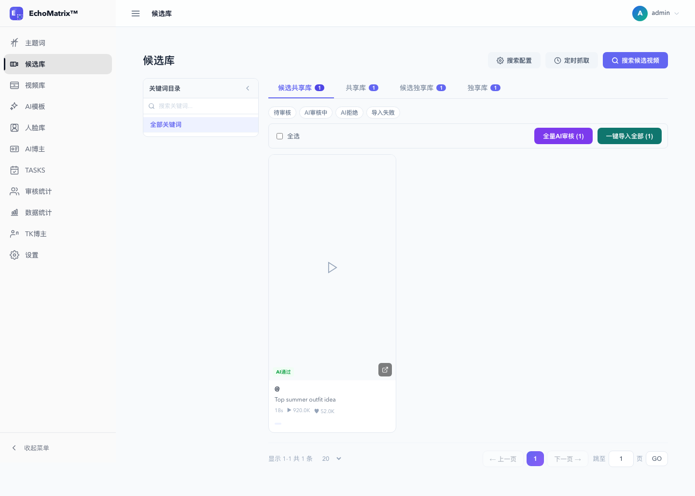
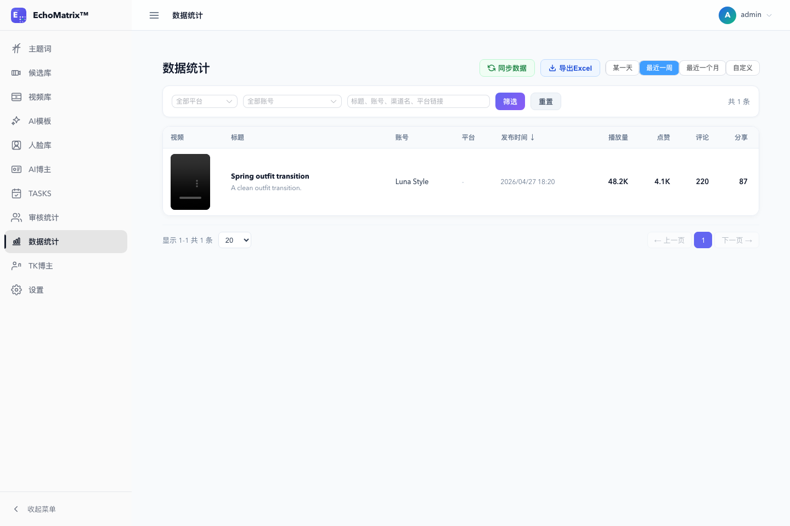

# Echo Matrix

Echo Matrix 是一个面向 AI 视频矩阵生产、账号运营和多平台发布的内部运营系统。它把候选素材搜索、AI 模板分析、视频生成任务、人工审核、发布队列、账号渠道绑定、自动发布和数据统计放在同一个控制台里管理。

项目由两个应用组成：

- `backend/`：FastAPI 后端，负责业务 API、数据库、后台队列、第三方服务集成和发布调度。
- `frontend/`：Vue 3 前端，负责运营控制台、审核工作台、任务管理和统计界面。

> README 中的截图使用演示数据生成，展示的是当前前端页面结构和主要工作流。

## 截图

### 首页



### 登录



### AI 博主管理



### 任务管理



### AI 模板



### 候选库



### 发布数据统计



## 系统能力

### 账号运营

- AI 博主账号创建、编辑、标签绑定和标识管理
- 账号类型、性别、出镜模式、头像/照片、风格描述等资料维护
- TikTok、YouTube、Instagram 渠道绑定和状态同步
- 外部频道领取/确认/绑定 API
- 账号级定时发布配置：Cron、发布数量、随机延迟窗口、渠道库存检测
- 批量生成 AI 博主、补充模板、生成账号名称和 handle

主要文件：

- [accounts.py](backend/app/api/v1/accounts.py)
- [account_service.py](backend/app/services/account_service.py)
- [account_publish_scheduler.py](backend/app/services/account_publish_scheduler.py)
- [account_channel_reservations.py](backend/app/api/v1/account_channel_reservations.py)

### 候选库和素材导入

- 主题词、关键词和候选视频搜索
- Apify / RapidAPI / TikTok API 集成
- 候选视频按播放量、时长、发布日期、博主等规则过滤
- AI 审核候选视频，区分共享库、候选独享库、独享库等流转状态
- 候选视频导入为视频库资源，并可进一步生成 AI 模板
- 批量补充账号模板和自动补充库存

主要文件：

- [candidates.py](backend/app/api/v1/candidates.py)
- [candidate_service.py](backend/app/services/candidate_service.py)
- [candidate_scheduler_service.py](backend/app/services/candidate_scheduler_service.py)
- [topics.py](backend/app/api/v1/topics.py)
- [topic_service.py](backend/app/services/topic_service.py)

### 视频库和 AI 模板

- 视频源入库、解析、标签绑定、指标历史同步
- AI 模板创建、编辑、批量创建和重跑
- 模板分析 pipeline：
  - 视频理解
  - 抽帧
  - unique outfit 识别
  - outfit 单品分析
  - 单品图生成
  - 新造型图生成
- 分析结果同步到视频任务的 `shots`

主要文件：

- [video_sources.py](backend/app/api/v1/video_sources.py)
- [video_source_service.py](backend/app/services/video_source_service.py)
- [video_ai_templates.py](backend/app/api/v1/video_ai_templates.py)
- [video_ai_service.py](backend/app/services/video_ai_service.py)

### 视频任务和审核

- `video_tasks` 是父任务，`video_sub_tasks` 是子任务
- 一个父任务最多生成 3 个子任务，每个子任务对应一个视频
- 子任务支持审核、打分、NG 时间点、人工备注、操作员统计
- 只有一个子任务会被选中进入发布队列
- 发布队列支持排序、状态回退、重新生成发布文案
- 定时发布调度会从账号的 queued 队列取出库存并调用发布服务

主要状态：

```text
pending -> generating -> reviewing -> stashed -> queued -> publishing -> published
                                    -> decision_rejected
                                    -> abandoned
publishing -> publish_failed -> stashed
```

主要文件：

- [video_tasks.py](backend/app/api/v1/video_tasks.py)
- [video_task_service.py](backend/app/services/video_task_service.py)
- [video_task.py](backend/app/models/video_task.py)
- [publish_meta_service.py](backend/app/services/publish_meta_service.py)
- [video_scoring_service.py](backend/app/services/video_scoring_service.py)

### 发布和数据统计

- 支持内部 Open API 发布和外部发布 API 两套 adapter
- 同一次发布可混合不同渠道来源
- 发布状态按 channel 维度汇总为 `completed`、`partial`、`failed`、`processing`
- 支持发布回调、状态轮询、指标同步、账号表现快照
- 数据统计页可按平台、账号、日期、关键字筛选并导出 CSV

发布 payload 会附带：

```json
{
  "promotion_code": "12345678",
  "ext_products": []
}
```

`ext_products` 当前保留为空数组，后续商品链路会从 `video_tasks.shots` 提取后补全。

主要文件：

- [video_publications.py](backend/app/api/v1/video_publications.py)
- [video_publication_service.py](backend/app/services/video_publication_service.py)
- [video_publication.py](backend/app/models/video_publication.py)
- [publication_metrics_scheduler.py](backend/app/services/publication_metrics_scheduler.py)
- [lark_notify_scheduler.py](backend/app/services/lark_notify_scheduler.py)

### 发布口令分发

系统提供全局 `PromotionCodeDistributor`，用于生成不重复的 8 位数字带货口令。

策略：

- 启动时读取数据库已有 `video_publications.promotion_code`
- 按 `PROMOTION_CODE_POOL_SIZE` 预生成口令池
- 补池时同时根据数据库和内存数据去重
- 内存去重范围包括池内、已租出、已提交、已废弃口令
- 池内剩余低于 30% 时异步补池
- 数据库唯一索引兜底
- 当前设计面向单实例部署；多实例部署需要额外数据库预占用或分布式锁

主要文件：

- [promotion_code_service.py](backend/app/services/promotion_code_service.py)
- [g013_add_promotion_code_to_video_publications.py](backend/alembic/versions/g013_add_promotion_code_to_video_publications.py)

### 人脸库、标签、标识和配置

- 人脸图库管理和 AI 选脸
- 标签管理，支持视频源、模板、账号绑定
- 标识管理，支持账号打标和置顶
- 系统设置和 pipeline 设置
- 用户管理和登录鉴权

主要文件：

- [face_library.py](backend/app/api/v1/face_library.py)
- [face_select_service.py](backend/app/services/face_select_service.py)
- [tags.py](backend/app/api/v1/tags.py)
- [flags.py](backend/app/api/v1/flags.py)
- [settings.py](backend/app/api/v1/settings.py)
- [auth.py](backend/app/api/v1/auth.py)

## 核心数据流

```text
主题词 / 账号标签
    -> 候选视频搜索
    -> AI 审核
    -> 视频源入库
    -> AI 模板分析
    -> 账号生成视频任务
    -> 3 个子任务生成视频
    -> 人工审核选择 1 个视频
    -> queued 发布队列
    -> 自动/手动发布
    -> video_publications
    -> 状态同步和指标统计
```

## 项目结构

```text
.
├── backend/
│   ├── app/
│   │   ├── api/v1/          # FastAPI 路由
│   │   ├── core/            # 配置、安全、日志、异常
│   │   ├── db/              # SQLAlchemy engine/session/init
│   │   ├── models/          # 数据表模型
│   │   ├── schemas/         # Pydantic schema
│   │   ├── services/        # 业务服务、后台队列、第三方 API 集成
│   │   └── utils/           # GCS、TikTok、Apify、RapidAPI 工具
│   ├── alembic/             # 数据库迁移
│   ├── scripts/             # 维护脚本和测试脚本
│   ├── .env.example         # 后端环境变量样例
│   └── pyproject.toml
├── frontend/
│   ├── src/
│   │   ├── api/             # Axios API 封装
│   │   ├── components/      # 公共组件
│   │   ├── layouts/         # 页面布局
│   │   ├── router/          # Vue Router
│   │   ├── stores/          # Pinia store
│   │   ├── utils/           # 前端工具
│   │   └── views/           # 业务页面
│   ├── .env.example
│   ├── package.json
│   └── vite.config.js
├── docs/                    # API 和集成文档
├── deploy/                  # systemd 模板
├── deploy.md                # 服务器部署说明
└── README.md
```

## 技术栈

后端：

- Python 3.9+
- FastAPI
- SQLAlchemy 2.0 async
- Alembic
- PostgreSQL
- asyncio 后台 worker
- Google Gemini
- Apify / RapidAPI / TikTok API
- Google Cloud Storage
- Open API / ExtPub 发布服务

前端：

- Vue 3
- Vite
- Vue Router
- Pinia
- Element Plus
- Axios
- ECharts
- Three.js / GSAP / Lottie

## 本地开发

### 后端

后端的 Python 顶层包是 `backend/app`，所以后端命令建议都在 `backend/` 目录执行。

```bash
cd backend
cp .env.example .env
```

至少配置：

```env
DATABASE_URL=postgresql+asyncpg://postgres:postgres:localhost:5432/task_manager
ADMIN_USERNAME=admin
ADMIN_PASSWORD=your-strong-password-here
AUTH_SECRET=your-random-secret-at-least-32-chars
CORS_ORIGINS=http://localhost:5173,http://127.0.0.1:5173
```

安装依赖：

```bash
uv sync
```

如果不用 `uv`：

```bash
python -m venv .venv
. .venv/bin/activate
pip install -e .
```

迁移数据库：

```bash
uv run alembic upgrade head
```

启动服务：

```bash
uv run uvicorn app.main:app --reload
```

健康检查：

```bash
curl http://localhost:8000/health
```

API 文档：

```text
http://localhost:8000/docs
```

### 前端

```bash
cd frontend
cp .env.example .env
npm install
npm run dev
```

默认地址：

```text
http://localhost:5173/echo-matrix/
```

前端环境变量：

```env
VITE_API_BASE_URL=http://localhost:8000/api/v1
VITE_COMFYUI_EMBED_URL=http://your-comfyui-host:8189
```

## 环境变量

后端配置见 [backend/.env.example](backend/.env.example)。

基础：

- `DATABASE_URL`：PostgreSQL 连接串
- `ADMIN_USERNAME` / `ADMIN_PASSWORD`：初始管理员
- `AUTH_SECRET`：登录 token 签名密钥，至少 32 字符
- `AUTH_TOKEN_EXPIRE_MINUTES`：登录有效期
- `CORS_ORIGINS`：允许访问后端的前端来源
- `LOG_LEVEL` / `LOG_DIR`：日志级别和目录

AI 和素材：

- `GOOGLE_API_KEY`
- `UPLOAD_API_BASE_URL`
- `VIDEO_IMAGE_UPLOAD_API_URL`
- `GCS_PROJECT_ID`
- `GCS_BUCKET_NAME`

候选库和 TikTok：

- `APIFY_TOKEN`
- `RAPIDAPI_KEY`
- `TIKWM_API_KEY`
- `TIKTOK_SEARCH_USE_RAPIDAPI`

发布：

- `OPEN_API_BASE_URL`
- `OPEN_API_CLIENT_ID`
- `OPEN_API_CLIENT_SECRET`
- `OPEN_API_CALLBACK_URL`
- `OPEN_API_CHANNEL_USAGE_TYPES`
- `EXT_PUB_API_BASE_URL`
- `EXT_PUB_API_KEY`
- `PROMOTION_CODE_POOL_SIZE`

外部频道：

- `ACCOUNT_CHANNEL_OWNER_ID`
- `ACCOUNT_CHANNEL_API_KEY`

通知：

- `LARK_WEBHOOK_URL`

## 后台服务

FastAPI 启动时会启动多组后台任务：

- 视频模板 pipeline 队列
- AI 账号生成队列
- 发布状态轮询器
- 发布指标同步调度器
- 账号定时发布调度器
- 候选库搜索调度器
- Lark 日报通知调度器
- 频道状态轮询器
- 频道名称同步调度器
- 发布文案生成 worker
- 带货口令分发器

入口在 [main.py](backend/app/main.py)。

## 常用命令

后端：

```bash
cd backend
uv sync
uv run alembic upgrade head
uv run uvicorn app.main:app --reload
```

迁移状态：

```bash
cd backend
uv run alembic current
uv run alembic heads
uv run alembic history --verbose
```

语法检查：

```bash
cd backend
uv run python -m compileall app
```

前端：

```bash
cd frontend
npm install
npm run dev
npm run build
npm run preview
```

## 常见问题

### ModuleNotFoundError: No module named 'app'

通常是命令执行目录不对。请在 `backend/` 下运行：

```bash
cd backend
uv run uvicorn app.main:app --reload
```

不要直接执行 service 文件：

```bash
python backend/app/services/candidate_service.py
```

如果必须在项目根目录运行，设置：

```bash
PYTHONPATH=backend backend/.venv/bin/uvicorn app.main:app --reload
```

### 数据库字段不存在

执行迁移：

```bash
cd backend
uv run alembic upgrade head
uv run alembic current
```

### 前端跨域或 API 404

开发环境检查 `frontend/.env`：

```env
VITE_API_BASE_URL=http://localhost:8000/api/v1
```

生产环境如果通过 Nginx 同域反代，通常使用：

```env
VITE_API_BASE_URL=/api/v1
```

同时确认后端 `CORS_ORIGINS` 包含前端来源。

### AUTH_SECRET 启动错误

`AUTH_SECRET` 必须设置且不少于 32 字符。

## 部署

服务器部署请看 [deploy.md](deploy.md)，包括：

- 后端 `.env`
- PostgreSQL 和 Alembic 迁移
- 前端构建
- systemd 服务
- Nginx 反向代理
- 日志和更新流程

## 文档

- [视频任务 API](docs/api-video-tasks.md)
- [账号频道 OpenAPI](docs/account_channel_openapi.md)
- [外部发布 API 对接说明](docs/api_posts_platform_accounts.md)
- [Open API 补充文档](docs/OPEN_API_cc.md)
- [Iframe 集成说明](IFRAME_INTEGRATION.md)
